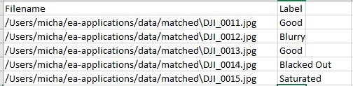

### Analysis of Thermal Imaging Using Machine and Predictive Learning Classification

This repository contains the code for the final project in Earth Analytics to analyze data acquired by UAV sensors. Thermal imaging of
powerlines and utility poles allow utility companies to identify objects that emit excessive heat before they fail. An efficient and cost-effective method of aquiring these images is through the use of drone mounted FLIR sensors. These return .jpg files measuring 640 x 512 pixels in 256 shades in the long range infrared band of the electromagnetic spectrum.

Approximately 20% of these images are considered useless after review by the thermographer, often due to being blacked-out, saturated, or blurry. At $0.05 per image, removing these images prior to review could result in significant cost savings. This program uses machine
learning algorithms to classify the images prior to being passed on for human review. 

The workflow requires the following Python 3.6.5 packages: 
* NumPy 
* Pandas  
* Matplotlib 
* Scipy 
* Sklearn 
* Rasterio
* Opencv-Python

### Required Installations

1. Install the Thermal Environment on your Local Computer.

About Conda Environments: https://conda.io/docs/user-guide/tasks/manage-environments.html

An environment for conda has been created. To load it, run:

conda env create -f therm-env.yml

Note that it takes a bit of time to run this setup
Also note that for the code above to work, you need to be in the directory where the therm-env.yml file lives.

On Mac or Linux:
source activate therm-env

On Windows:

source activate therm-env

The environment name is therm-env as defined in the therm-env.yml file.

### Run Workflow

1. Clone the repository https://github.com/mlevis1/uav-image-analysis, or download and decompress the zip file (see the green button for Clone or download). 

2. Open a terminal and change directories to this directory (`cd uav-image-analysis`).

3. Launch Jupyter Notebook and open methods/final_product.ipynb.

This notebook will implements the Random Forest Classification method, which proved to be the most accurate method of the four options explored for a training dataset provided by PrecisionHawk. 

### Methods Explored

Methods implemented use a 60% training and 40% testing dataset of thermal images that includes the following labels: Good, Blacked Out, Saturated, Blurry. Provides code to serialize and save machine learning algorithms.

* Linear Regression (linear-regression.ipynb)
* Support Vector Machine (svm-model.ipynb)
* Gradient Boosting (gradient-boosting.ipynb)
* Random Forest (random-forest.ipynb):

Image files in .jpg format are read from folders using the read_images function, and then input into a learning model that has been
trained with a sample of images of known quality. Image names and classifications (0 for good, 1 for blacked-out, 2 for saturated, 3 for blurry) are read from test-images.csv. I am currently working with 431 labeled training and test images.

final_product.ipynb: Loads model for use with new, unlabeled data sets. The final product consists of a python module with which the user will input new folders of data for processing. Output is a dataframe of image names labeled as good, blacked-out, saturated, or blurry. 

test_notebooks.ipynb: Contain miscellaneous notebooks for viewing and manipulating data.

### Scripts

fit_models.py: 

read_images reads in images and returns list of picture ID numbers based on the image name

svm_layers builds layers of SVM and fits model to the data
              
supervised_models fits supervised models to the data and returns metrics
               
plot_confusion_matrix plots normalized confusion matrix

